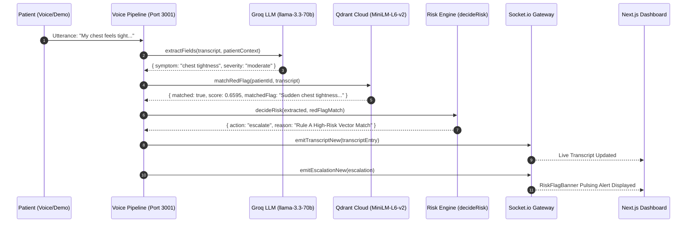

# Wellcall — Comprehensive Monorepo Architecture & Project Overview

> **Wellcall** is an AI-powered post-discharge patient follow-up and clinical intelligence platform. It combines real-time voice synthesis and speech-to-text, LLM clinical extraction, vector memory search, deterministic clinical risk assessment, and live clinician web dashboards to ensure post-surgical patients are monitored safely after leaving the hospital.

---

## 🌟 Executive Summary & Core Value Proposition

When patients return home after major medical procedures (e.g., Post-Coronary Artery Bypass Graft, Congestive Heart Failure, Post-Laparoscopic Cholecystectomy), traditional follow-up relies on manual nurse phone calls or reactive patient portal messages. 

**Wellcall** provides:
1. **Conversational Patient Check-Ins**: Interactive voice dialogue via Deepgram STT and Rime TTS.
2. **Structured LLM Clinical Extraction**: Extracts symptoms, severity, mood, and medication adherence using **Groq (`llama-3.3-70b-versatile`)**.
3. **Semantic Red-Flag Vector Search**: Embeds patient utterances locally using **ONNX `Xenova/all-MiniLM-L6-v2`** feature extraction and queries **Qdrant Cloud** to catch paraphrased red flags (e.g., matching *"my chest feels tight"* to *"Sudden chest tightness or heavy sternal pressure"* with a similarity score of ~0.66).
4. **Deterministic Risk Decision Engine**: A rule-based clinical engine (`decideRisk.ts`) that guarantees immediate nurse escalation on high-risk red flag matches, eliminating LLM hallucination or rating variance risks.
5. **Real-Time Clinician Dashboard**: A Next.js 14 web application featuring live transcript feeds, patient care plan cards, past call timelines, and high-contrast pulsing escalation banners (`RiskFlagBanner`).
6. **Auditable Compliance Logging**: Produces human-readable and structured JSON audit records for quality assurance and legal compliance.

---

## 📐 Monorepo Architecture & Service Directory Structure

The project is structured as a **Turborepo** monorepo under `@wellcall`:

```text
wellcall/
├── packages/
│   └── shared-types/             # Central TypeScript interfaces & socket contracts
├── services/
│   ├── extraction/               # Groq LLM clinical field extractor (llama-3.3-70b-versatile)
│   ├── qdrant-memory/            # Local ONNX vector embeddings + Qdrant Cloud vector memory
│   ├── risk-engine/              # Deterministic risk engine (decideRisk.ts, Rules A-E)
│   ├── audit-report/             # Structured compliance report generator & text formatter
│   └── voice-pipeline/           # Gateway Fastify REST API, Socket.io server, & demo runner
├── apps/
│   └── dashboard/                # Next.js 14 Clinician Web Dashboard
├── data/
│   └── synthetic-patients/       # Synthetic post-discharge care plan JSON datasets
├── infra/
│   └── env.example               # Central environment configuration reference
└── PROJECT_OVERVIEW.md           # Master project technical overview
```

---

## 🧩 Monorepo Workspace Packages

### 1. `@wellcall/shared-types` (`packages/shared-types`)
Central source of truth for all TypeScript data models across services:
- `Patient`, `Medication`: Patient demographics, care plan, medications, and red flag lists.
- `CallSession`, `TranscriptEntry`: Call metadata and transcript snippets.
- `ExtractedFields`: Structured outputs (`symptom`, `severity`, `mood`, `medAdherence`).
- `RedFlagMatch`: Qdrant vector search result (`matched`, `riskTier`, `matchedFlag`, `reason`).
- `RiskDecision`: Clinical action (`action: 'log' | 'escalate'`, `reason`).
- `Escalation`: Nurse escalation alert payload.
- `AuditRecord`: End-of-call compliance log structure.
- `ServerToClientEvents`, `ClientToServerEvents`: Socket.io event interfaces.

---

### 2. `@wellcall/extraction` (`services/extraction`)
- **Engine**: Groq API using model `llama-3.3-70b-versatile` via the OpenAI TypeScript SDK format.
- **Functionality**: Extracts structured fields strictly from patient transcript snippets using OpenAI-style function calling (`extract_patient_checkin_fields`).
- **Signature**: `extractFields(transcriptText: string, patientContext?: { condition: string }): Promise<ExtractedFields>`
- **Fallback**: Includes offline heuristic fallback (`parseFallbackHeuristic`) for offline testing.

---

### 3. `@wellcall/qdrant-memory` (`services/qdrant-memory`)
- **Engine**: Local ONNX feature extraction (`@xenova/transformers` model `Xenova/all-MiniLM-L6-v2`) generating 384-dimensional vector embeddings, connected to **Qdrant Cloud**.
- **Care Plan Vector Store (`carePlanStore.ts`)**: Seeds patient red flags into Qdrant collection `patient_red_flags`.
- **Semantic Red-Flag Matcher (`redFlagMatcher.ts`)**: Searches `patient_red_flags` filtered by `patientId`. Scores $\ge 0.50$ trigger a positive red-flag match.
- **Session Memory (`sessionMemory.ts`)**: Persists persistent memories across patient calls (`patient_session_memory`) with non-duplicating corrections and soft-delete capabilities.

---

### 4. `@wellcall/risk-engine` (`services/risk-engine`)
- **Engine**: Deterministic clinical risk evaluator (`riskDecision.ts`).
- **Rule Hierarchy**:
  - **Rule A (High-Risk Vector Match)**: If Qdrant returns a high-risk red flag match ($\text{score} \ge 0.50$), **escalate immediately**.
  - **Rule B (Severe Symptom)**: If LLM extracted `severity === 'severe'`, **escalate immediately**.
  - **Rule C (Medium-Risk Match + Moderate Severity)**: If medium-risk flag match AND `severity === 'moderate'`, **escalate**.
  - **Rule D (Medication Non-Adherence)**: If patient skipped medication while experiencing active symptoms, **escalate**.
  - **Rule E (Routine Check-in)**: Log routinely with `action: 'log'`.

---

### 5. `@wellcall/audit-report` (`services/audit-report`)
- **Engine**: Pure compliance report generator (`reportGenerator.ts`).
- **Functionality**:
  - `generateAuditRecord(input)`: Assembles complete `AuditRecord`.
  - `formatAuditRecordAsText(record)`: Formats human-readable ASCII audit report suitable for nurses, compliance officers, and legal reviews.

---

### 6. `@wellcall/voice-pipeline` (`services/voice-pipeline`)
- **Engine**: Fastify HTTP server + Socket.io server running on **Port 3001**.
- **REST Endpoints**:
  - `GET /patients`: List all patient care plans.
  - `GET /patients/:id`: Retrieve single patient by ID.
  - `GET /patients/:id/calls`: List past calls enriched with escalation status.
  - `GET /calls/:id`: Fetch single call session & transcripts.
  - `GET /audit`: Fetch all recorded audit logs.
  - `POST /demo/run?scenario=routine|escalation`: Trigger Fallback Demo Mode without requiring live voice hardware.
- **Fallback Demo Mode (`demoScript.ts`)**: Provides canned routine and escalation transcript sequences that drive the real AI intelligence pipeline asynchronously and emit live socket events.

---

### 7. `@wellcall/dashboard` (`apps/dashboard`)
- **Engine**: Next.js 14 App Router, React, Tailwind CSS.
- **Components**:
  - `CarePlanCard.tsx`: Displays active patient diagnosis, medications, and red-flag list.
  - `RiskFlagBanner.tsx`: Subscribes to Socket.io `escalation:new` events and displays high-contrast pulsing red escalation alert banner.
  - `CallHistoryTimeline.tsx`: Renders past call history showing continuity of care ("never start from zero").
  - `LiveTranscript.tsx`: Displays real-time streaming patient dialogue.

---

## 🔄 End-to-End Execution Flow



---

## 🧪 Verification & Development Commands

From the root directory `c:\krishna\wellcall`:

### 1. Run Typecheck Across All Workspaces
```powershell
node node_modules/turbo/bin/turbo run typecheck
```

### 2. Run Test Suites Across All Workspaces
```powershell
node node_modules/turbo/bin/turbo run test
```

### 3. Seed Qdrant Cloud Vectors
```powershell
node services/qdrant-memory/dist/seed.js
```

### 4. Trigger Fallback Demo Mode via REST
- **Escalation Scenario**:
  ```powershell
  Invoke-RestMethod -Uri "http://localhost:3001/demo/run?scenario=escalation&patientId=patient-01" -Method Post
  ```
- **Routine Scenario**:
  ```powershell
  Invoke-RestMethod -Uri "http://localhost:3001/demo/run?scenario=routine&patientId=patient-02" -Method Post
  ```

---

## 🔑 Environment Configuration (`infra/env.example`)

Set these environment variables in your environment or `.env` file:

```ini
# Groq API Key for clinical field extraction
GROQ_API_KEY=gsk_...

# Qdrant Cloud URL & API Key for vector memory search
QDRANT_URL=https://...cloud.qdrant.tech
QDRANT_API_KEY=...

# Deepgram Speech-to-Text API Key (for live voice audio)
DEEPGRAM_API_KEY=...

# Rime TTS API Key (for live text-to-speech synthesis)
RIME_API_KEY=...

# Gateway Server HTTP & Socket.io Port
GATEWAY_PORT=3001
```

---

## 🛠️ Summary of Tech Stack
- **Languages**: TypeScript (ES2022 / Node 20), Node.js
- **LLM / AI Engine**: Groq API (`llama-3.3-70b-versatile`), OpenAI SDK
- **Embeddings & Vector Database**: `@xenova/transformers` (`all-MiniLM-L6-v2`), Qdrant Cloud (`@qdrant/js-client-rest`)
- **Backend & Gateway**: Fastify, Socket.io
- **Frontend Dashboard**: Next.js 14, React 18, Tailwind CSS
- **Monorepo Orchestration**: Turborepo 2.x, pnpm v9
