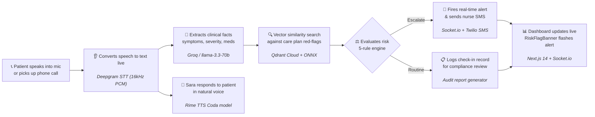

# WellCall 🩺

> **An AI voice agent for post-discharge patient check-ins — listens for warning signs, escalates to the care team instantly.**

*Submitted to STARFORGE 2026 Hackathon — VoxForge Track*

[](https://nextjs.org)
[](https://typescriptlang.org)
[](https://fastify.dev)
[](https://socket.io)
[](https://deepgram.com)
[](https://groq.com)
[](https://qdrant.tech)
[](https://rime.ai)
[](https://twilio.com)

---

## 📌 One-Sentence Claim

**WellCall is an AI-powered voice outreach agent that calls post-discharge patients, semantically matches spoken symptoms against personalized care plans in Qdrant vector memory, and immediately escalates recovery red flags to human nurses via real-time dashboard alerts and SMS.**

---

## 🧑‍⚕️ Explain It Like I'm Not Technical

When patients leave the hospital after major surgery, they go home with a stack of discharge papers and a follow-up appointment two or three weeks away. But recovery complications don't wait two weeks. A patient who develops chest tightness at home — or quietly stops taking their post-operative medication — can quickly end up back in the emergency room.

The problem isn't that hospital care teams don't care. It's that nurses physically cannot call every single discharged patient every single day. There simply aren't enough hours or staff.

WellCall automates that daily outreach call. An AI voice assistant named **Sara** calls patients, asks how they are feeling, and listens carefully to what they say in plain English or Hindi. If something sounds wrong — not just by exact keywords, but by the underlying *meaning* of their recovery symptoms — Sara escalates it to the care team immediately. The nurse dashboard lights up in real time, and an urgent SMS goes straight to the on-call nurse's phone.

If the patient is recovering smoothly, Sara logs the routine check-in for compliance review and moves on. No wasted clinician hours, and no high-risk patient slips through the cracks.

---

## 🚀 Live Demo Links

| Resource | Deployed URL |
|---|---|
| **Clinician Dashboard** | [https://wellcall-dashboard-nine.vercel.app](https://wellcall-dashboard-nine.vercel.app) |
| **Voice Gateway API** | [https://wellcall.onrender.com](https://wellcall.onrender.com) |

> ⚠️ **Note on Render Free Tier:** The voice gateway server is hosted on Render's free tier. If no calls have been placed recently, **please allow ~20–30 seconds for the instance to cold-start** upon loading the dashboard or initiating a call.

To trigger an automated escalation demo directly against the live server without a microphone:
```bash
curl -X POST "https://wellcall.onrender.com/demo/run?scenario=escalation&patientId=patient-01" \
  -H "Content-Type: application/json" -d "{}"
```

---

## 📜 Gateway Server Trace & Audit Log (Representative Output)

Below is an illustrative trace of the Gateway server log during a high-risk escalation sequence and audit report generation:

```text
[gateway/socket] [CALL] voice:start — callId: call-mic-1786402065477, patient: patient-01
[gateway/socket] Emitting transcript:new -> "Hello Jane, this is Sara checking in after your discharge. How are you feeling today?"

[demoRunner] Processing Patient Utterance: "I'm having really sharp chest pain and it's hard to breathe"
[redFlagMatcher] Patient: patient-01 | Similarity Score: 0.5840 (Threshold: 0.5) | Utterance: "I'm having really sharp chest pain and it's hard to breathe" | Matched: true
[gateway/socket] Emitting escalation:new -> Patient's description matches a known high-risk pattern: "Sudden chest tightness or heavy sternal pressure"
[notifyNurseSMS] SMS sent successfully. SID: SM8a9f... Status: queued

[orchestrator/audit] Generated audit record:
════════════════════════════════════════════════════════════════════
  WELLCALL — CALL AUDIT REPORT
════════════════════════════════════════════════════════════════════
Patient Name:    Jane Smith (Seeded Demo)
Patient ID:      patient-01
Condition:       Post-Coronary Artery Bypass Graft (CABG)

TRANSCRIPT
  [04:17:47] Patient: "I'm having really sharp chest pain and it's hard to breathe"

EXTRACTED CLINICAL FIELDS
  Symptom:       sharp chest pain and hard to breathe
  Severity:      severe

RED FLAG ANALYSIS
  [Match 1] Risk Tier: HIGH
    Matched Flag: "Sudden chest tightness or heavy sternal pressure"
    Reason:       Patient's description matches known red flag

FINAL RISK DECISION
  Action:        ⚠ ESCALATE TO NURSE
  Rationale:     Patient's description matches a known high-risk pattern

ESCALATION RECORD
  Escalation ID: esc-1786402068237
  Acknowledged:  No — PENDING
════════════════════════════════════════════════════════════════════

[demoRunner] Processing Patient Utterance: "Oh sorry, I misspoke! I meant my shoulder is sore from sleeping wrong, my chest is fine."
[redFlagMatcher] Patient: patient-01 | Similarity Score: 0.4865 (Threshold: 0.5) | Utterance: "Oh sorry..." | Matched: false
[demoRunner] LLM Extracted     : {"symptom":"sore shoulder","severity":"mild","mood":null,"medAdherence":null}
[demoRunner] Risk Action        : LOG (Routine check-in, no risk indicators detected)
[gateway/socket] Emitting call:status -> call-mic-1786402065477: ended
```

---

## 🗺️ Visual Architecture Diagram



---

## 🛠️ Tech Stack

| What it does in plain language | Technology used |
|---|---|
| Streams patient microphone voice live and transcribes it into text | **Deepgram STT** — 16kHz 16-bit mono PCM over Socket.io (`voice:chunk`) for `/mic`, 8kHz μ-law for Twilio |
| Extracts structured clinical symptoms, severity, and medication adherence | **Groq LLM** (`llama-3.3-70b-versatile`) via function-calling schema |
| Matches spoken symptoms to known danger signs, even if paraphrased | **Qdrant Cloud** — vector similarity search with local ONNX embeddings (`Xenova/all-MiniLM-L6-v2`) |
| Decides whether to escalate based on strict clinical rules (no LLM guessing) | **Custom Risk Engine** — 5-rule deterministic decision tree (`decideRisk.ts`) |
| Speaks back to the patient with warm, natural neural voice synthesis | **Rime TTS** — Coda neural voice model returning raw audio buffers (`voice:audio`) |
| Dispatches instant SMS alerts to the on-call nurse's mobile phone | **Twilio SMS** — Node.js SDK wrapped in safe error handlers |
| Shows live transcripts, patient profiles, and pulsing alerts without refresh | **Socket.io + Fastify** — bidirectional real-time event streaming backend |
| Clinician web interface — patient directory, care plan cards, audit ledger | **Next.js 14** — App Router, React 18, Tailwind CSS |
| Remembers past call history so returning patients don't start from scratch | **Qdrant Vector Storage** — `patient_session_memory` collection accessed via `getMemory()` |
| Enforces strict monorepo-wide type safety and data models | **TypeScript** — shared type package (`@wellcall/shared-types`) |

---

## ✨ Key Features & Proof of Functionality

### 1. 🎤 Real-Time Live Microphone Streaming & Transcription
- Audio captured at 16kHz 16-bit mono PCM via Web Audio API `ScriptProcessorNode` on `/mic`.
- Chunks streamed directly over Socket.io `voice:chunk` to Deepgram, emitting `transcript:new` events live to the dashboard.

### 2. 👩‍⚕️ "Sara" AI Persona Across All Touchpoints
- Standardized AI persona named **Sara** integrated across 16 patient-facing files (voice greetings, system prompts, audit summaries, UI headers).
- Supports bilingual English and Hindi/Hinglish greeting dialogues.

### 3. 👥 Multi-Patient Selection Picker
- Patient picker dropdown on `/mic` allowing clinicians to select between all 4 seeded synthetic patients (John Doe, Jane Smith, Robert Johnson, Emily Davis).
- Automatically locks input during active calls to maintain context integrity.

### 4. 🧠 Memory-Personalized Greetings Across Calls
- Fetches recent session memory from Qdrant Cloud (`getMemory`) at call start.
- Synthesizes personalized greetings based on structured `wasEscalated` and `category` memory flags:
  - **New Patient (Robert):** *"Hello Robert! My name is Sara..."* (generic first-time greeting).
  - **Returning Symptom (Jane):** *"Welcome back, Jane! In our last check-in, you reported some symptoms..."*
  - **Returning Escalation (John):** *"Welcome back, John! During our last call, we flagged your symptoms for the care team..."*

### 5. 🔊 Rime TTS Voice Playback in Browser
- Synthesizes warm conversational responses via Rime API.
- Audio buffers (`voice:audio`) are streamed to the browser and played sequentially via Web Audio API `AudioBufferSourceNode`. Exact byte counts matched between server emission and browser playback.

### 6. 🧠 Structured Clinical Field Extraction
- Groq `llama-3.3-70b-versatile` parses raw transcript into structured `ExtractedFields` (`symptom`, `severity`, `mood`, `medAdherence`). Verified by 3/3 passing unit tests in `claudeExtractor.test.ts`.

### 7. 🔍 Semantic Red-Flag Vector Search
- Spoken utterances are embedded into 384-dimensional vectors using local ONNX `all-MiniLM-L6-v2` and matched against Qdrant Cloud care plans. Catches paraphrased symptoms (e.g. matching *"chest feels tight"* to *"Sudden chest tightness or heavy sternal pressure"* with a similarity score of 0.5840). Verified by 4/4 passing unit tests in `redFlagMatcher.test.ts`.

### 8. ⚖️ 5-Rule Deterministic Risk Decision Engine
- Evaluates Rules A through E in order to guarantee reproducible, non-hallucinatory escalations. Verified by 6/6 passing unit tests in `riskDecision.test.ts`.

### 9. 🚨 Live Socket.io Escalation & Sync Acknowledgment
- Emits `escalation:new` to dashboard clients, displaying pulsing `RiskFlagBanner` alerts.
- Clicking "Acknowledge" syncs status across the banner, database, and `/audit` inspection drawer via `escalation:acknowledged` Socket.io events.

### 10. 📲 Live Twilio Nurse SMS Alerts
- Automatically dispatches SMS alerts containing patient details, flagged symptom, and call ID directly to the on-call nurse's mobile phone via Twilio SMS API.

### 11. 📋 Auditable Compliance Ledger
- Assembles full audit records capturing verbatim transcripts, extraction output, Qdrant similarity scores, risk rationales, and nurse acknowledgment status — exportable as JSON or formatted text reports.

---

## 📊 Test Suite Results

```text
Tasks: 12 successful, 12 total
Time:  7.93s
```

| Service Package | Test File | Status | Passed Cases | Feature Verified |
|:---|:---|:---:|:---:|:---|
| **`@wellcall/extraction`** | `claudeExtractor.test.ts` | **PASSED** | 3 / 3 | Groq LLM tool-calling clinical field extraction |
| **`@wellcall/qdrant-memory`** | `redFlagMatcher.test.ts` | **PASSED** | 4 / 4 | Qdrant Cloud vector search & ONNX 384d red-flag similarity |
| **`@wellcall/risk-engine`** | `riskDecision.test.ts` | **PASSED** | 6 / 6 | Rules A–E deterministic risk decision hierarchy |
| **`@wellcall/voice-pipeline`** | `demoRunner.test.ts` | **PASSED** | 2 / 2 | End-to-end routine log and high-risk nurse escalation flows |
| **`@wellcall/shared-types`** | `tsc --noEmit` | **PASSED** | 12 / 12 | Monorepo-wide type safety and interface contracts |

---

## 💻 How to Run Locally

### Prerequisites
- Node.js ≥ 20, pnpm ≥ 9
- A running Qdrant instance ([local Docker](https://qdrant.tech/documentation/quick-start/) or Qdrant Cloud cluster)
- API keys for Deepgram, Groq, Rime, and Twilio (see `infra/env.example`)

### Quickstart Setup

```bash
# 1. Clone the repository
git clone https://github.com/krix2112/wellcall.git
cd wellcall

# 2. Install workspace dependencies
pnpm install

# 3. Create environment configuration
cp infra/env.example .env
# Edit .env and supply your DEEPGRAM_API_KEY, GROQ_API_KEY, QDRANT_URL, etc.

# 4. Build all workspace packages
pnpm build

# 5. Start the Voice Gateway Server (Port 3001)
node services/voice-pipeline/dist/index.js

# 6. In a separate terminal, start the Clinician Dashboard (Port 3000)
pnpm --filter @wellcall/dashboard dev
```

Open [http://localhost:3000](http://localhost:3000) for the Clinician Dashboard and [http://localhost:3000/mic](http://localhost:3000/mic) for the interactive call test interface.

### Running Test Suites

```bash
# Run full monorepo typecheck
pnpm typecheck

# Run unit test suite across all workspace packages
pnpm test
```

### Triggering Automated Demos Without a Microphone

```bash
# Routine post-discharge check-in (no escalation)
curl -X POST "http://localhost:3001/demo/run?scenario=routine&patientId=patient-01" \
  -H "Content-Type: application/json" -d "{}"

# High-risk cardiac escalation scenario
curl -X POST "http://localhost:3001/demo/run?scenario=escalation&patientId=patient-01" \
  -H "Content-Type: application/json" -d "{}"
```

---

## ⚠️ Known Limitations & Operational Constraints

- **Browser Audio Autoplay:** Web browsers require an explicit user gesture (e.g. clicking "Start Call" on `/mic`) before allowing Web Audio API playback of incoming WebSocket audio buffers.
- **Render Cold-Start Delay:** On Render's free hosting tier, backend instances spin down during periods of inactivity. Initial requests may take **20–30 seconds** to wake up.
- **Single Active Call Concurrency:** The current gateway process instance manages one active voice stream at a time. Session isolation for concurrent multi-call scaling is supported architecturally but unscaled in this build.
- **Triage Assistance Scope:** WellCall is an automated outreach and clinical triage assistant. It does not provide medical diagnoses or autonomous prescriptions. All escalations require human nurse verification.
- **Synthetic Patient Records:** All patient profiles, medical histories, and red flags in this repository are **100% synthetic**. No Protected Health Information (PHI) is used anywhere.

---

## 👥 Team

| Name | Role |
|---|---|
| **Krishna** | Full-stack — Intelligence layer (extraction, Qdrant, risk-engine, audit-report), voice pipeline integration, frontend components |
| **Vansh** | Full-stack — Voice I/O (Deepgram STT, telephony, orchestration wiring) |
| **Mehar** | UI/UX design |
| **Akanksha** | Frontend development |

---

## 📄 License

[MIT](./LICENSE)
